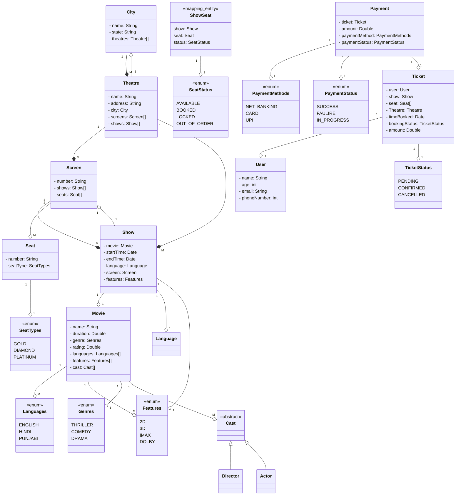

# Book My Show

`Where do you think BMS earns majority of its revenue from?`

It's not their ads, live events, booking comissions etc., but from their Booking/Cinema **Management System** instead (until a few years ago atleast).

## Requirement Gathering

The Gathered Requirements and identified `Entities`, *`Attributes`*, and **`Behavior`**:

1. Multiple `Cities`
2. Multiple `Theatres`
3. Multiple `Screens`
4. Multiple `Movies`
5. Multiple `Shows` for each Movie
6. Multiple `Seats`
7. Multiple *`Seat types`* - Gold, Diamond, Platinum *`(ENUM)`*
8. Multiple features with every Hall - 2D, 3D, IMAX, Dolby SS
9. Allow `User` to **`Search`** based on Movie *`name`*
10. **`Filter`** Functionality for:
    1. *`Movies`*
    2. *`Theatres`*
    3. *`City`*
    4. *`Language`*
    5. *`Rating`*
    6. *`Genre`*
11. Users can **`book`** `Tickets` and **`pay`** and make `Payment` via multiple *`Payment Methods`*
    1. *`UPI`*
    2. *`Credit Card`*
    3. *`Netbanking`*
12. `Coupon Code`
13. List of **`available seats`**
14. Calculating *`Price`* based on Multiple Parameters

    ```price = fn(seatType, day, time, theatre, movie)```

15. **`Cancel/Update`** a `booking`
    * Upto 1 hour before the movie start time

## Use-Case Diagram

```startuml
@startuml
left to right direction

actor User
actor Admin

rectangle BMS {
  usecase "Search a Movie" as Search
  usecase "Seach by Name" as SearchByName
  usecase "Seach by Theatre" as SearchByTheatre
  usecase "Book a Movie" as Book
  usecase "Make Payment" as Pay
  usecase "UPI" as UPI
  usecase "Net Banking" as NetBanking
  usecase "Card" as Card
  usecase "Cancel/Update" as Update
  usecase "CRUD on Entities" as CRUD
  usecase "Check Availability" as Check
  
  (NetBanking) .> (Pay) : extends
  (UPI) .> (Pay) : extends
  (Card) .> (Pay) : extends
  (SearchByName) .> (Search) : extends
  (SearchByTheatre) .> (Search) : extends

  (Book) .> (Check) : includes
}

User --> Search
User --> Book
User --> Pay
User --> Update
Admin --> CRUD
@enduml
```

## Admin APIs

* `POST api/v1/movie`
* `PUT/PATCH api/v1/movie/{id}`

    `PUT vs PATCH?`

    PUT API is a complete update. Even if a single field has to be updated, we need to pass the entire payload.

    PATCH API is a partial update. If only the name of the movie is to be updated, we can update the entity using just that attribute. It's of 2 types

  * **Merge Patch:** Here we pass only those fields that need to be updated. For e.g.,

    ```json
    PATCH api/v1/movies/2
    {
      "name": "MahaGuru"
    }
    ```

  * **JSON Patch:** Here we update the entities using the operations that we want to do. For e.g.,

    ```json
    PATCH api/v1/movies/2
    {
      "operation": "update", // can also be add, delete, etc.
      "field": "name",
      "value": "MahaGuru"
    }
    ```

## Class Diagram



`Why did we not put a Seat Status in the Seat Class?`

Because, the seat will be shared across Shows. If we put the status in the Seat Class, then it will be reflected in all the shows using that seat. Hence, we created a **Mapping Entity**.

`Why do we have an Amount in both Ticket and Payment?`

To support **Partial Payments**.