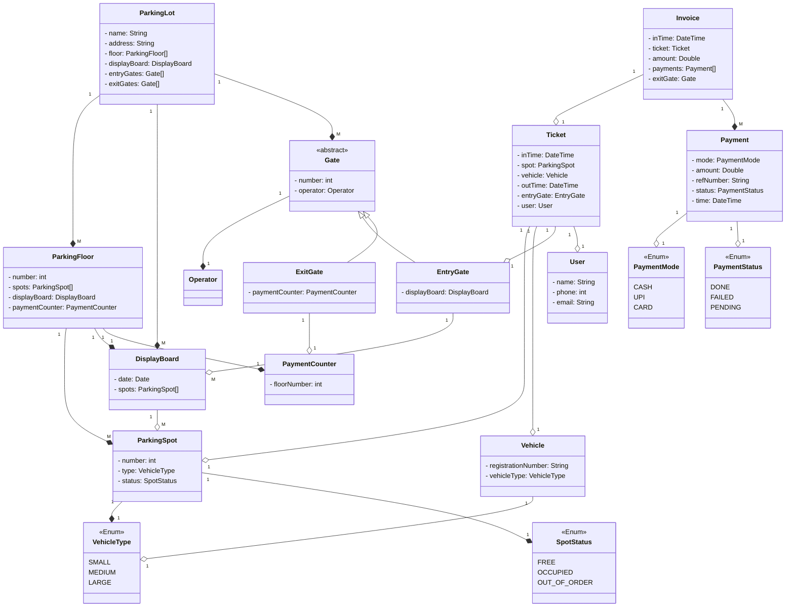

# Design a Parking Lot

## Problem Statement

It's a management system problem, and IT is filled with designing such solutions for all kinds of management issues, like a movie ticket management system.

In this case, we're trying to solve the problem of management of a parking lot. Some steps would include:

* A car comes to the parking lot operator
* He/she hands out the ticket, which will have the time you came to the parking lot
* Now we can go ahead and park the car at the parking spot assigned to us
* But can you leave as soon as you enter your car back? No, we now need to pay according to the number of hours it was used perhaps
* Also, the parking lot operator will not only hand out a ticket, but they need a system which tells them how many spots are available.
* They also need a system to calculate their fare

`Now how do we get these requirements from the interviewer?`

The 3 kinds of questions we'll ask are:

* current
* future
* behaviour

### Structural Questions

1. `How many floors?` - multiple floors (configurable)
2. `Entry and Exit gates?` - multiple (configurable)
3. `How many types of slots?` - multiple (configurable)
4. `On what basis will we have these different slots?` - different kinds of vehicles
   1. Small
   2. Medium
   3. Large
5. A *`display board`* on each floor will tell us how many slots are available on each floor. We'll have them at:
   1. Gate
   2. Each Floor
6. `How do you pay?` - Payment modes
   1. Cash
   2. Card
   3. UPI
7. `Where do you pay?`
   1. Exit Counter
   2. Dedicated automated booth on each floor
   3. Online
8. A car can only be parked at its assigned spot, not any other (even larger)
9. `How do we calculate the fare? Is the fare going to be the same for all car kinds?` - per hr fare
   1. Fees = base + per hour
      1. S - 50 (base fee) + 80 (per hour)
      2. M - 80 (base fee) + 100 (per hour)
      3. L - 100 (base fee) + 120 (per hour)

    > This requirement looks like a candidate for a strategy pattern.

Usually we get these kinds of requirements ready by the interviewer on let's say a piece of paper.

Try to restrict yourself to not suggest feature suggestions.

## Use-case Diagram

Think of software functionalities in your use-case diagram rather than real world actions like coming to the parking lot, parking the car, etc.

```startuml
@startuml
left to right direction

actor Customer
actor EntryOperator
actor ExitOperator
actor Admin

rectangle ParkingLot {
  usecase "Pay" as Pay
  usecase "UPI" as UPI
  usecase "Cash" as Cash
  usecase "Card" as Card
  usecase "Checks Availability" as ParkingAvailable
  usecase "Generate Ticket" as Generate
  usecase "Collect Payment" as Collect
  usecase "Calculate Fee" as Calculate
  usecase "Checkout" as Checkout
  usecase "CRUD (All kinds)" as CRUD
  
  (Cash) .> (Pay) : extends
  (UPI) .> (Pay) : extends
  (Card) .> (Pay) : extends

  (Generate) .> (ParkingAvailable) : includes
  (Collect) .> (Calculate) : includes
}

Customer --> Pay
EntryOperator --> Generate
ExitOperator --> Collect
ExitOperator --> Checkout
Admin --> CRUD
@enduml
```

Before going further, let's discuss on APIs which will be used in this application.

### What are APIs

* A way to call methods over the network
* Done using REST (which is a specification)

#### URI

Endpoint (Path)

#### HTTP Verbs

Kinds of operations

1. CREATE
   1. `POST`
2. READ
   1. `GET` /user
   2. `GET` /user/**1** (**1** here is a path parameter)
3. UPDATE
   1. `PUT` & `PATCH`
4. DELETE
   1. `DELETE`

HTTP VERB /resource/{id}

`Get all the parking lots?`<br>
> GET `/parking-lots` (kebab-case)

`Get a PL with id 2?`<br>
> GET `/parking-lots/2`

`Get all users who are active?`<br>
> GET `/users?status=active`

There are 3 ways to send data to a server:

* Path parameter - reserved for resources identifiers `e.g. /users/2`
* Query Parameter - send data to a server in key-value pair `e.g. /users?status=active`
* Request Body - KVP or a JSON which is encrypted to transfer data safely

`Get all users who're active and of type Teacher?`<br>
> GET /users?status=active&type=teacher

#### Response Codes

* `2xx` - Success
  * `200` OK
* `3xx` - Redirections
  * let's say you went to `google.com`, and it redirected it to `google.in`. In this case, the response code returned will be 302
* `4xx` - Client Error
  * `404` Not Found
  * `400` Bad Request
* `5xx` - Server Error
  * `500` Internal Server Error

##### URI vs URL

URI (identifier) is the whole thing

http://google.com - this whole thing is URI, includes the protocol and the domain.

If we remove the protocol from the URI, we're left with a URL (locator).

## Final Requirements

Look for Nouns in your requirements, you'll identify the Entities.

The Gathered Requirements and identified `Entities`, *`Attributes`*, and **`Methods`**:

Build an online `parking lot` management system that can support the following requirements:

* Should have multiple `floors`.
* Multiple `entries and exit gates`.
* A `user` has to collect a `ticket` at entry and **`pay`** at or before exit.
* Pay at:
  * Exit counter (Cash to the `parking attendant`)
  * Dedicated automated booth on each floor - `Payment Counter`
  * Online
* `Payment` via *`type`*:
  * Cash - *`Enum PaymentType`*
  * Credit Card - *`Enum PaymentType`*
  * UPI - *`Enum PaymentType`*
* Allow entry for a `vehicle` if a `spot` is available for it. - **`CheckAvailability`**
* Show on the `display board` at entry if a spot is not available.
* *`Parking Spots of 3 types`*:
  * Large - *`Enum ParkingType`*
  * Medium - *`Enum ParkingType`*
  * Small - *`Enum ParkingType`*
* A car can only be parked at its spot. Not on any other (even larger).
* A display on each floor with the *`status`* of that floor.
* **`Fees calculated`** based on per hour price: e.g. 50 rs for the first hour, then 80 rs per extra hour. `Invoice`
  * Small - 50, 80 - **`FeesCalculatedStrategy`**
  * Medium - 80, 100 - **`FeesCalculatedStrategy`**
  * Large - 100, 120 - **`FeesCalculatedStrategy`**

Usually when we have a complex system like this, instead of looking for nouns in the requirements, it might be easier to visualize the flow and draw it on a piece of paper to identify the entities by considering the interaction points. For example:

1. User comes in a car to the entry gate - `User, Car, EntryGate`
2. There's a parking attendant sitting who hands out a parking ticket - `EntryParkingAttendant, ParkingTicket`
3. Then the user enters the parking lot where we have different floors - `ParkingLot, Floors`
4. On each floor we have multiple parking spots, display board, and Payment Counter - `ParkingSpot, DisplayBoard, PaymentCounter`
5. Then the user proceeds to the Exit Gate where a payment is made and the Invoice is given back - `ExitGate, ExitParkingAttendant, Payment, Invoice`
   * Now it could be possible that we consider just kind of Entry Gate and use it for both Entry and Exit, but that makes it less configurable for the future. What if we want some special behavior for the Exit Gate, hence it might be better to maintain different Entities.

## Class Diagram



Note: This system supports Partial Payments, hence the amount in the Invoice and Payments might not be the same (User could pay via multiple Modes)

## Parking Lot APIs

In this design system, instead of a CLI system like we created in TicTacToe, we'll instead use an API driven architecture for the parking lot management system. These APIs will follow the 3-layered Architecture, i.e., Controller, Service, and Repository.

Request Models that we create for the controllers are different from our Entity models. They're supposed to be lighter and easier for our clients to use. Hence, if we're creating a Parking Lot for example, we need not pass the whole objects for the Parking Floor, or the Display Board. These entities might be present in our Database, in which case we can just take an Id for those things to map them with this Parking Lot, or else, in case of Parking Floors, we can just take an input of how many floors are needed, and maybe how many spots per floor are needed as well. This will save us from an extremely nested data structure and Request DTOs (Data Transfer Objects) will come to our rescue.

Also, Controllers are supposed to be very Lean and aren't supposed to have much logic, but they're still responsible for 2 things:

   1. Request validation
   2. Data Transformation

### Admin APIs (CRUD operations on all Entities)

#### Create a Parking Lot

**POST** `/api/v1/parking-lot`

**Request Body:**

We'll pass the same fields as the Parking Lot Class

```json
{
   "name": "Tantia Tope",
   "address": "Delhi",
   "": "",
   "": "",
   "": "",
}
```

## Dependency Injection in Spring

`In a 3-layered architecture, we have 3 main classes, how do we provide instances of these classes to calling classes?`

* Controller requires the Service Class
* Service requires the Repository Class

Now an option is we can create objects using the constructors, but then we cannot have singleton objects, or define the scope of those objects in general. This could be inefficient in terms of memory use to begin with, but more importantly, spring is not aware of these objects.

Spring Boot, apart from acting as a Web Framework, also acts as an `IoC Container`. But what is this?

It will provide these object dependencies to us.

Dependency here - `Controller - Service - Repository`

* Now Repository Class doesn't have a Dependency on another class, so Spring creates an object of Repository class and stores it in it's Container.

* Now it can create an object of Service (since it already has an object of its dependent service) and stores it in its container.

* Similarly, now a container of Controller class can be created.

This process is called as `Inversion Of Control (IoC)` implemented using `Dependency Injection`.

`But how does Spring know,`

1. `Which objects to create?`

   * Through a process known as **Component Scanning**. We'll tell Spring I want you to create an object of this class, through Annotations, i.e., `@Component`. But we haven't added this anywhere yet. How did our API run?
   * We added the `@RestController` annotation which is an extension of the `@Component` Annotation.
   * Similarly, we annotate the Service Class with `@Service`, and Repo with `@Repository` Annotation
   * The **scope** of these objects will be Singleton using the `@Component` Annotation, unless we specify otherwise.
   * When the app starts up, Spring will resolve all these dependencies.
   * Apart from Component Scanning, there are other ways to achieve the same, using Paths, and Packages that contain the dependencies, but Component Scanning way is the most preferred and famous way.

2. `How does DI work?`

   * There are 3 different ways of Injection
     * `Constructor Injection:` This is the most common way of injecting dependencies. Spring sees that Service Class needs a Repository Class object, and it passes that since it has that with itself.

         ```Java
         // Constructor Injection
         public Service(Repository repository) {
            this.repository = repository
         }
         ```

