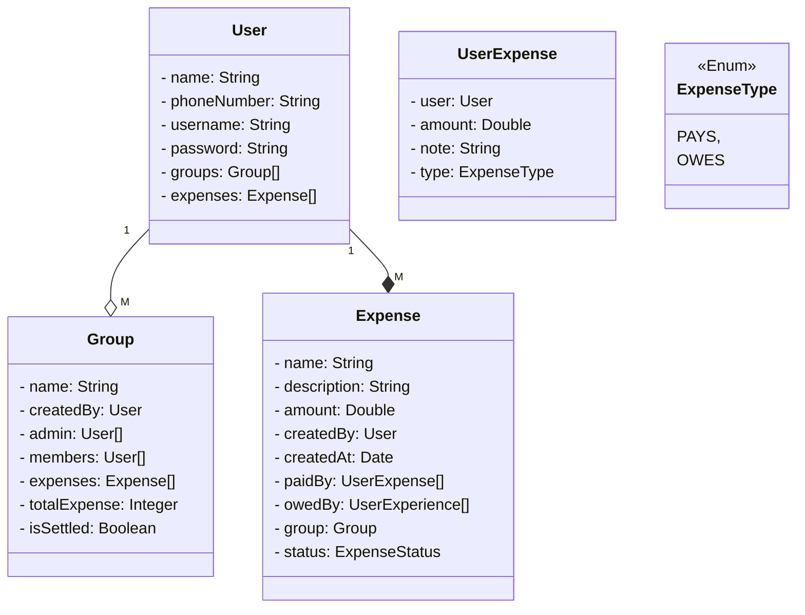
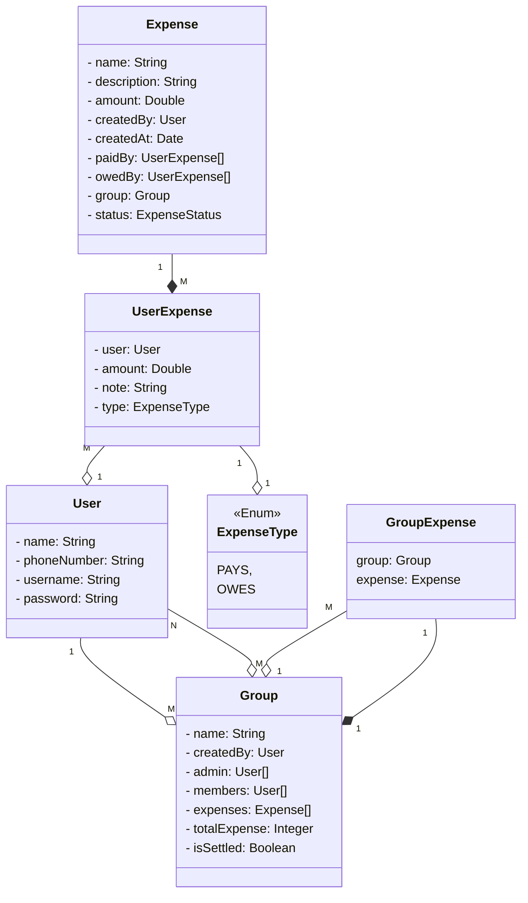
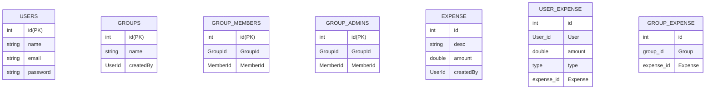

# Splitwise

## Motivation

A lot of time we have expenses that have to be distributed between a group of people, and we need to track who paid and who owes money to whom.

Splitwise as an app maintains these expenses and reminds people about the money that they owe.

## Example

Group: `Goa`

Expense: `Hotel`

| Person | Paid | Owes  |
| ------ | ---- | ----- |
| A      | 1000 | 0     |
| B      | 2000 | -1000 |
| C      | 0    | 1000  |

C -> B - 1000

In another group, A -> C - 2000

**Simplified payment?**

*A -> B - 1000*

## Requirements

The Gathered Requirements and identified `Entities`, *`Attributes`*, and **`Methods`**:

- `Users` can **`register`** and **`update`** their profiles.
- A user's profile should contain at least their *`name, phone number, and password`*.
- Users can participate in `expenses` with other users.
- Users can participate in `groups`.
- To **`add an expense`**, a user must specify
  - either the *`group`*
  - or the other *`users`* involved in the expense
  - along with *`who paid what`*
  - and *`who owes what`*
  - They must also specify a *`description`* of the expense.
- A user can see their **`total owed amount`**.
- A user can see a **`history of the expenses they're involved in`**.
- A user can see a **`history of the expenses made in a group`** that they're participating in.
- Users shouldn't be able to query about groups they are not a member of.
- Only the user who has created a group (*`admin`*) can **`add/remove members`** to the group.
- Users can **`request a settlement`**. The application should show a list of transactions, which when executed will ensure that the user no longer owes or receives money from any other user.
- Users can request a settlement for any group they're participating in.
  - The application should show a list of transactions, which if executed, will ensure that everyone participating in the group is settled up (owes a net of 0 Rs).
  - Note that it will only deal with the expenses made inside that group. Expenses outside the group need not be settled.
- Good to Have Requirements:
  - When settling a group, we should try to **`minimize the number of transactions`** that the group members - should make to settle up.

## Use-case Diagram

```startuml
@startuml
left to right direction

actor User
actor Admin

rectangle ParkingLot {
  usecase "Register" as Register
  usecase "Add an Expense" as AddAnExpense
  usecase "Group Expense" as GroupExpense
  usecase "Individual Expense" as IndividualExpense
  usecase "Settle-up" as Settleup
  usecase "Minimize Transactions" as MinimizeTransactions
  usecase "Create a Group" as CreateAGroup
  usecase "Add members" as AddMembers
  usecase "Update Members" as UpdateMembers
  
  (GroupExpense) .> (AddAnExpense) : extends
  (IndividualExpense) .> (AddAnExpense) : extends

  (Settleup) .> (MinimizeTransactions) : includes
}

User --> Register
User --> AddAnExpense
User --> Settleup
Admin --> CreateAGroup
Admin --> AddMembers
Admin --> UpdateMembers
@enduml
```

## Class Diagram



Here the User and Group are related with multiple attributes (like createdBy, admins, members). In such cases we cannot denote a general cardinality between 2 classes. Instead, we need to ask for which relation are we trying to find out the cardinality. Is it the Members, Admins, or the User who creates the group.

Ask which relation we need the cardinality for:

| Attribute | Cardinality | Comments                                                                |
| --------- | ----------- | ----------------------------------------------------------------------- |
| createdBy | 1 : M       | 1 User can create many Groups, but each group has 1 owner               |
| admins    | M : N       | 1 User can be admin of many Groups, and each Group can have many Admins |
| members   | M : N       | Same argument as above                                                  |

Also, with the above approach, we have the `group` attribute part of the `Expense` class. This could be null for an individual expense, so instead we'll create a mapping class between Group and Expense.



## Schema Diagram

A schema diagram will have:

1. Atomic values
2. Mapping Tables
3. FK & PK relationships



## CLI for Splitwise

Until now we've seen how REST APIs work, which execute over a network, but we can also have a CLI app that runs locally.

e.g. `splitwise register Abhinav`

This calls the `UserController` and registers Abhinav.

But how do we achieve this, we might take inputs using the `Scanner` class and have a switch case on the command given.

```java
  switch (command) {
    case "register":
      // ...
    case "addexpense":
      // ...
  }
```

But this way we violate OCP. To tackle this we use something known as the **Command Design Pattern**.

## Command Design Pattern

This is a pattern using which we create CLI applications.

Let's say we have 3 commands:

- CREATE USER
- SETTLE
- ADD EXPENSE

### Steps

1. Create a Parent `Command` class
   1. The ideal way how this class would work is that we give it a String, and it tells us which Command to execute.
   2. `String --> Command`
2. Create an interface for the Command class

    ```java
      interface Command {
        boolean matches(String command); // this will check whether the incoming command matches with the implementing class` command
        void execute(input); // if the command matches, then this method implementation is called to do the work
      }
    ```

    We'll have multiple Command classes implementing this interface, like `CreateUserCommand` and `SettleUpCommand`.

3. Now we'll have a `CommandExecutor`. It will:
   1. Run `match()` on all commands
   2. Run `execute()` on the matched command
   3. Register commands
   4. Deregister commands
   
   The above 2 can be implemented using the Registry Pattern.

  ```java
    public class CommandExecutor {
    private List<Command> commandList = new ArrayList<>();
    public void addCommand(Command command) {
        commandList.add(command);
    }

    public void removeCommand(Command command) {
        commandList.remove(command);
    }
    
    public void execute(String input) {
        for (Command command: commandList) {
            if (command.matches(input)) {
                command.execute(input);
            }
        }
    }
}
  ```

4. Now to execute our CLI, we'll call using the `main()` method.

  ```java
    // add commands to the commands registry in CommandExecutor
    main() {
      while(true) {
        sout("Enter input: ");
        String input = scanner.nextLine();
        commandExecutor.execute(input);
      }
    }
  ```

  Now since this is about the structure of a codebase, hence it is a *Structural Design Pattern*.

## How do we store the Users` passwords in the Database?

There are 2 approaches for this:

1. **Encryption** - This seems like the better thing to do. But this is not a good idea when it comes to storing passwords in Databases because Encryption works on 2-way encoding.

    To encrypt we use a public key, and to decrypt, we use a private key. Anyone with a public key can encrypt something and store it in the database. But the problem is that if anyone gets ahold of the private key and access to the database, they can essentially decrypt every password in the database.  Which is a huge security concern.

2. **Hashing** - This is more widely used in this scenario as it uses a 1-way encoding technique. The input password is encoded using a hashing function and the original password cannot be retrieved from the encoded password once hashed. This way, even if someone gets ahold of the passwords from the database, there is no way of getting back the original user's password.

    The internal systems will only use the hashed value.

Now someone might argue that the password is being passed as plain text over the network and someone might intercept the traffic and get to know your password. But that is not how it works.

There's dual encryption happening in this case.

1. Firstly, the password is not sent as part of the query parameters, but in the request body, which has implicit encryption.

2. Secondly, we'll not be using HTTP to transfer this data. We'll be using HTTPS which encrypts the packets in transit.

    `HTTPS -> HTTP over TLS`

### So does it mean that the hashed password can never be cracked?

A very common approach to breaking passwords is known as rainbow tables. It is essentially a table of very common passwords and their common hash values. Now if a hacker gets ahold of someone's hashed password, they can simply run the hashed value against this table and find out what might be the original password.

<https://www.geeksforgeeks.org/understanding-rainbow-table-attack/>

### Problems with Hashing

#### Collision

Using hashing functions, it might be possible that 2 passwords get the same hashed value because of Collisions.

> What if 2 users have the same password, how do we get different passwords for every user?

This is where the concept of **Salt** comes in. i.e., in front of each of these values, we add a small random value (salt) before hashing.

This shouldn't be as simple as the username, but something more random so it's not easily guessable. It still has to be predictable so that the same can be passed every time a user logs in.

This is one of the techniques we used earlier:

```
username password
    |       |
  hash()  hash()
      \   /
      hash()
```

This can be complicated and also slow sometimes.

Today, we use an open-source algorithm known as BCrypt.

- most popular
- secure and fast
- 1-way hashing
- uses Salt, which will be different for each user
  - collisions are lesser
  - increases the randomness of the hashes

Reference: <https://auth0.com/blog/hashing-in-action-understanding-bcrypt/>

