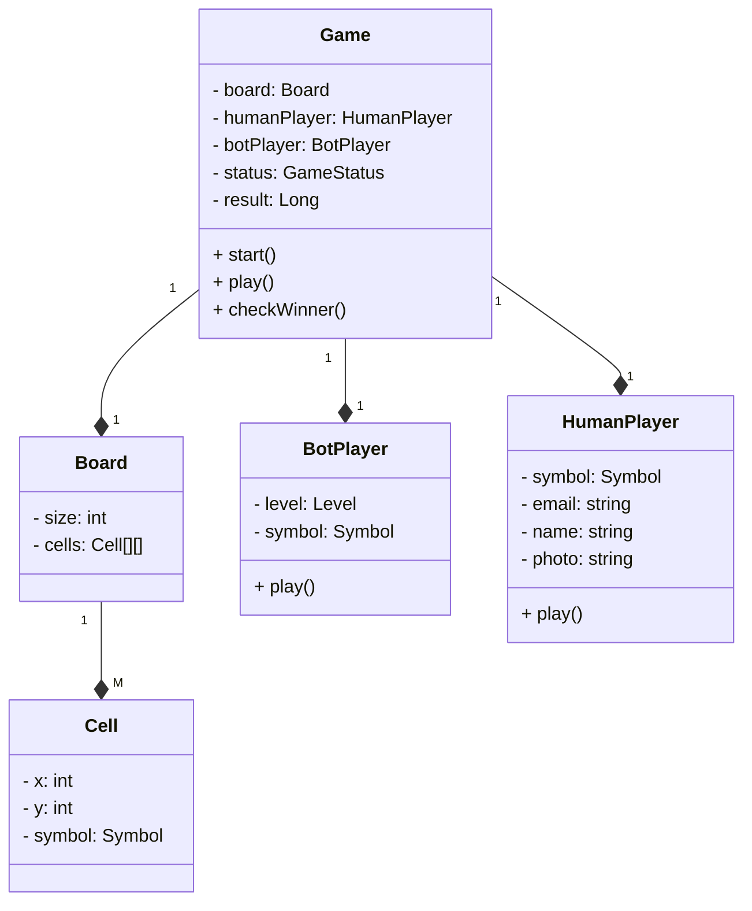
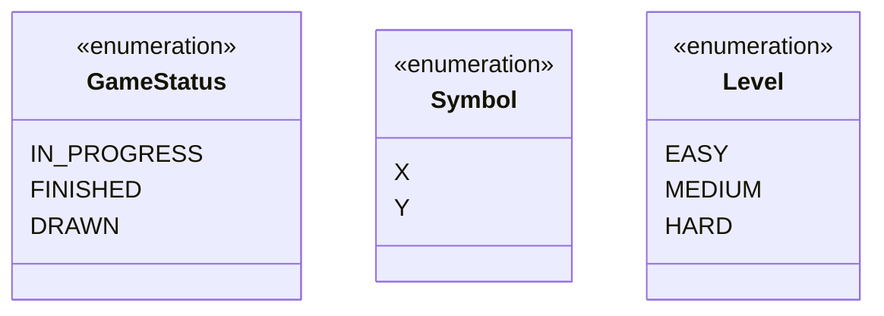

# Tic Tac Toe

This might seem easy at first, but let's delve into it and see how this pans out. But extremely important from an interview point of view.

What we want to understand is:

- Approach for design
- Requirements gathering
- Entities
- Class Diagram

## Problem Statement

The Problem statement could be anything, like Design. When asked for Design, we have:

- Knowns
- Unknowns
  - Ask for more questions like an overview, or what is x?

## Requirement Gathering

This is what needs to be implemented, but that might not give the entire picture, so asking questions and gathering requirements becomes very important.

`Requirement Gathering = Asking Questions`

- Current scope
- Future scope
- Behaviour

Now we cannot ask A LOT of questions, but write them down and categorize them to be asked. For this activity, some valid questions might be:

- **Current Scope** (easier to guess, and most of these questions might even not be required)
  - Structural Components (what is the game made up of)
    - Size of board
      - `N x N OR 3 x 3 to begin with`
    - How many players
      - `Human` and `Computer/Bot`
    - Types of players
    - Symbols
      - `O and X`

- **Future Scope** (what can change or be made dynamic)
  - `Need an N x N board`
  - `How many players, we could have multiple`

- **Behaviour** (Think where will you start, and form a flow of events)
  - Your Symbol `(O OR X)`
  - Whom are you going to play against `(Human or Bot)`
  - If Bot, What's the Difficulty Level `(Easy/Medium/Hard)`
  - Who should start the Game `(maybe Randomly)`
  - How will we play `Alternatively`
    - If a player has 3 consecutive symbols (in a column/row/diagonal) `Then the player wins`
    - Could there be a Draw/Tie `If all the spaces are filled and no one won`

> `FOCUS ON REQUIREMENTS, DON'T GIVE FEAUTURE SUGGESTIONS.`

`Once you have identified the requirements, should you jump into code directly?`

No, we need to design first.

## Design

The different:

- components
- Entities/classes

Look for Nouns in your requirements, you'll identify the Entities. We'll see some other techniques as well on the way.

The Gathered Requirements and identified `Entitities`, *`Attributes`*, and **`Methods`**

- `Board` can be of any NxN *size*
- There can be 2 `players`
- Each player will be allotted a `symbol`
- The symbol can be *`O and X`*
- The players can be of *`type`* either human or bot
- Each player will have a *`name, email and profile image`*
- Each bot will have a *`difficulty level`*
- Any random player can **`start`** the `game`
- The players will take turns to **`play`** alternatively
- The player with any consecutive N symmbols in a row, column or diagonal **`wins`** (check winner)
- If the board us full and no player has won, the game is a **`draw`**

## Class Diagram

### Root Class





Relationships

- Game --<> Board `(Game HAS A Board)`
  - `What type of association, Composition or Aggregation? How do we decide?`
  - Once I destroy the parent, do I need to keep the child?<br> i.e., once I destroy the Game, do I need the Board? No, hence **Composition**.
  - That means a filled diamond
  - `What next? Cardinality`
  - 1 : 1

- Board --<> Cell `(Board HAS A Cell)`
  - `What type of association, Composition or Aggregation? How do we decide?`
  - Once I destroy the Game, do I need the Board? No, hence **Composition**.
  - That means a filled diamond
  - `What next? Cardinality`
  - 1 : M (a board will have multiple cells)

- Game --<> BotPlayer `(Game HAS A BotPlayer)`
  - `What type of association, Composition or Aggregation? How do we decide?`
  - Once I destroy the Game, do I need the Bot? No, hence **Composition**.
  - That means a filled diamond
  - `What next? Cardinality`
  - 1 : 1

- Game --<> HumanPlayer `(Game HAS A HumanPlayer)`
  - `What type of association, Composition or Aggregation? How do we decide?`
  - Once I destroy the Game, do I need the Bot? No, hence **Composition**.
  - That means a filled diamond
  - `What next? Cardinality`
  - 1 : 1

## Problems with this design

1. Can't have `2 Human players`
2. `Tight coupling`
   - If I want to have game with more number if players, I'll have to modify my Game class which vialates OCP
3. `Field and method duplication` (Player and Bot)
4. This design will need method level playing

    ```java
    play() {
      if (EASY) { ... }
      else if (MEDIUM) { ... }
      else { ... }
    }
    // SRP and OCP violation
    ```

    `Whenever you see a method with an Enum in class, it'll violate OCP (like Level Enum along with *play()* in Bot)`

5. Between Game and Human, relationship is *HAS A*, and it's *Composition*. But a Human can play multiple games at the same time (opening multiple tabs and playing the game), and creating new Humans with each game means, we'll have repeated Images which will `consume a lot of memory`.

## Solutions

1. We should create a Parent `Player` class for Human and Bot.

    ```mermaid

    classDiagram
      class Game {
        - board: Board
        - players: Player[]
        - status: GameStatus
        - result: Long
        + start()
        + play()
        + checkWinner()
      }

      class Board {
        - size: int
        - cells: Cell[][]
      }
      
      class Cell {
        - x: int
        - y: int
        - symbol: Symbol
      }

      class Player {
        <<abstract>>
        - symbol: Symbol
        + play()
      }

      class BotPlayer {
        - level: Level
        + play()
      }

      class HumanPlayer {
        - email: string
        - name: string
        - photo: string
        + play()
      }

      Game "1" --*"1" Board
      Game "1" --* "M" Player
      Player <|-- BotPlayer
      Player <|-- HumanPlayer
      Board "1" --* "M" Cell

    ```


    This solves Point # 2 & 3 also.

  2. `What to do with the Bot class?`
    
      Maybe have `EasyBot, MediumBot, & HardBot` extending the `Bot` class. But there will be a lot of code duplication. Hence, we'll implement a strategy interface (MoveStrategy), and then we can have Concrete Classes implementing this interface. Do not name your strategies on what they are, rather what they do.

      We can have multiple playing strategies inheriting from PlayingStrategy, like MinMaxStrategy and RandomStrategy.

      Relationships

      - Bot --<> PlayingStrategy `(Bot HAS A PlayingStrategy)`
        - `What type of association, Composition or Aggregation?`
        - Once I destroy the Bot, I need not delete the Strategy as well, hence **Aggregation**.
        - That means an empty diamond
        - `What next? Cardinality`
        - 1 : 1
      - RandomStrategy IS A PlayingStrategy (Inheritence)
      - MinMaxStrategy IS A PlayingStrategy (Inheritence)

      ```mermaid

      classDiagram
        
        class BotPlayer {
          - level: Level
          - moveStrategy: MoveStrategy
          + makeMove()
        }

        class MoveStrategy {
          <<interface>>
          + makeMove()
        }

        class MinimaxMoveStrategy {
          + makeMove()
        }

        class ClusteringMoveStrategy {
          + makeMove()
        }

        class RandomMoveStrategy {
          + makeMove()
        }

        
        BotPlayer "1" --o "1" MoveStrategy
        MoveStrategy <|-- MinimaxMoveStrategy
        MoveStrategy <|-- ClusteringMoveStrategy
        MoveStrategy <|-- RandomMoveStrategy

      ```


   3. `Memory Wastage between Game and Human`

      `How do we use to fix the Human class?`

      Whenever there's memory wastage due to duplicated fields, we use Flyweight Pattern. i.e., have common fields from Human class (Extrinsic Class) extracted out to a User class (Intrinsic Class).

      Relationships

      - Human --<> User `(Human HAS A User)`
        - `What type of association, Composition or Aggregation?`
        - Once I destroy the Human, I won't delete the User, since it can be reused, hence **Aggregation**.
        - That means an **empty** diamond
        - `What next? Cardinality`
        - M : 1
        ```mermaid
        classDiagram
          class HumanPlayer {
            <<Extrinsic Class>>
            - user: User
            - sessionId: int
            + makeMove()
          }

          class User {
            <<Intrinsic Class>>
            - email: string
            - name: string
            - photo: string
          }

          HumanPlayer "M" --o "1" User
        ```

      
## Complete Class Diagram

```mermaid

    classDiagram
      class Game {
        - board: Board
        - players: Player[]
        - status: GameStatus
        - result: Long
        + start()
        + makeMove()
        + checkWinner()
      }

      class Board {
        - size: int
        - cells: Cell[][]
      }
      
      class Cell {
        - x: int
        - y: int
        - symbol: Symbol
      }

      class Player {
        <<abstract>>
        - symbol: Symbol
        + makeMove()
      }

      class HumanPlayer {
        <<Extrinsic Class>>
        - user: User
        - sessionId: int
        + makeMove()
      }

      class User {
        <<Intrinsic Class>>
        - email: string
        - name: string
        - photo: string
      }

      class BotPlayer {
        - level: Level
        - moveStrategy: MoveStrategy
        + makeMove()
      }

      class MoveStrategy {
        <<interface>>
        + makeMove()
      }

      class MinimaxMoveStrategy {
        + makeMove()
      }

      class ClusteringMoveStrategy {
        + makeMove()
      }

      class RandomMoveStrategy {
        + makeMove()
      }

      Game "1" --*"1" Board
      Game "1" --* "M" Player
      Player <|-- BotPlayer
      Player <|-- HumanPlayer
      Board "1" --* "M" Cell
      HumanPlayer "M" --o "1" User
      BotPlayer "1" --o "1" MoveStrategy
      MoveStrategy <|-- MinimaxMoveStrategy
      MoveStrategy <|-- ClusteringMoveStrategy
      MoveStrategy <|-- RandomMoveStrategy

    ```
